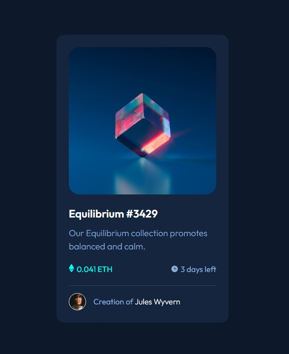
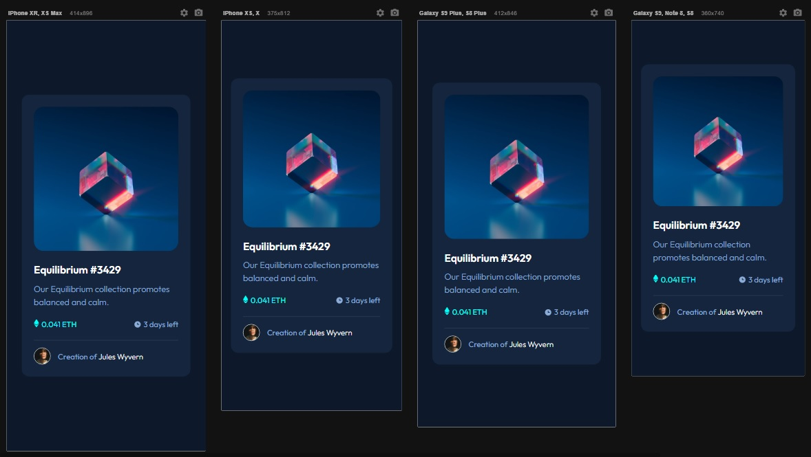

# README - Exercício Avançado - Frontend Mentor - NFT Card
Desafio proporto pelo site Frontend Mentor. Desenvolvimento de Layout de um NFT Card. Usamos no projeto linguagem HTML e CSS. não foi necessário o uso de responsividade, haja vista o cartão, tendo em vista seu tamanho, já se adaptar bem em todos os tamanhos de telas de dispositivos. 🚀🚀 

Abaixo estão as imagens e gif´s do site que foi reproduzido:

[]

[]

Abaixo estão as imagens dos layout´s feita por mim. Tentei ser o mais fiel possível:

- Layout Desenvolvido - Desktop
[]

- Layout Desenvolvido - Mobile
[]

## Tecnologias Utilizadas
- HTML
- CSS

## Desafios
Tivemos dificuldade no momento de colocar os efeitos de active (hover) com relação a imagem, pois nela tivermos que usar os pseudoelementos BEFORE e AFTER.
